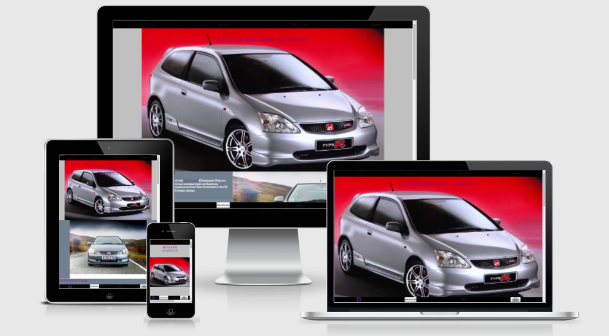

# wakey001/euro4-modern-classics
***
## Euro-4 Modern Classics

***

## Goal For This Project
Welcome to euro-4 modern classics , on this site my goal is to raise awrness for my personel passion cars.
As clean air zones pop up all over the uk i wanted to show people there are cars that although old, can be still relevant ,practical,reliable and still quite quick and also fun. I will do this by giving the user an intuitive ,fun,interesting and informative experiance. My aim is to excite the user enough for them to want to buy the car after visiting my site. I will provide links for the user to search for the vehicle featured on the site . Thank you for looking . Any feedback dont hesitate to drop me a message . 
***

## Table Of Contents
* Ux
    * User Goals
    
    * User Stories
   
    * Site Owner Goals
    
    * User Requirements And Expectations
      * Requirements 
      * Expectations
        
    * Design Choices
      * Fonts
      * Icons
      * Color
      * Structure
     
* Features
    * Existing Features
    * Features To Be Implemented
* Technology Used
    * Languages
    * Tools And Libraries
* Testing
* Deployment
* Credits
***
## Ux
***
### User Goals
* A website filled with relevant content
* A website easy to use on all platforms
* Appealing to all users ,not just car geeks
* The website should be fun, exciting
* The user should learn without realising 

### User Stories
* As a user I want the site to be easy to navigate
* As a user I want the site to have useful information
* As a user I want to be excited by the content 
* As a user I want the  conten to be visually stimulating
* As a user I want the site to be current and modern in design

### Site Owners Goals
* Stand out from the competition
* Users to use the search fuction to look for a car ,proves engagement .
* Potentially build up the site for various models if successfull
***

### User Requirements And Expextations
***
#### Requirements
* Easy to navigate via the menu
* Relevant quality content
* Clear information
* Visually appealing
####  Expectations
* The user expects links to open in a new tab
* The user expects the site to entertain them
* The user expects the site to react smoothly with minimal lag 
* The user expects the site to be visually appealing
### Design choices
***
As this model is the honda civic type r , I based the colors red, black, grey and white . I feel that enthusiasts will appreciate the authnticity of the site as well as subliminally teaching the unknowing user the colors assosiated with hondas type r branding.
#### Fonts
Fonts for my website are from [GOOGLE FONTS](https://fonts.google.com/). I have decided to go with [MATE SC](https://fonts.google.com/?query=mate+sc) as I feel in my opinion this is a modern and current feel and is easy to read.I also chose the same for my header as I feel this contasts well with the main text as when larger its flair is even more noticabe in my opinion.
#### Icons
 Icons for my website are from [FONT AWESOME LIBRARY](https://fontawesome.com/).The icons I have chosen are in fitting with the headings as they provide a little fun whilst giving a visual cue whilst also making the site feel modern and for a young audience.
#### Colors
I did initially base my colors on the typical branding by Honda of the Civic Type R ,however i felt this was not particularly modern or visually stimulating.  .
My initial colours were:

I then decided to only use these colours on the header in the nav bar and on the footer .
And went for somthing much more digestable and visually relaxing and stimulating in my opinion .
I used a website called coolers for inspiration , although not using one of their many palletes itself one did provide my inspiration. 
My new colours are:
rgb(96, 141,78)
rgb(158,214,56)
rgba(100,36,36,0.6)
rgba(122,212,200,0.6)

I HAVE USED CONTRAST CHECKER ON COOLERS TO MAKE SURE THE TEXT IS EASILY READABLE IN ALL COLORS.I have used 
#### Structures

### Features
***
#### Existing Features
##### Navigation
##### Hero Image
##### Welcome Section
#####

### Technologies Used
***
#### Languages
* [HTML5](https://en.wikipedia.org/wiki/HTML5)
* [CSS3](https://en.wikipedia.org/wiki/CSS)
#### Libraries And Frameworks
* [FONT AWESOME](https://fontawesome.com/)
* [GOOGLE FONTS](https://fonts.google.com/)
#### Tools
* [GIT HUB](https://github.com/)
* [GIT POD](https://www.gitpod.io/docs/configure/)
* [W3C HTML VALIDATION SERVICE](https://validator.w3.org/)
* [W3C CSS VALIDATION SERVICE](https://jigsaw.w3.org/css-validator/)
### Testing 
***
### Deployment
***

### Credits

